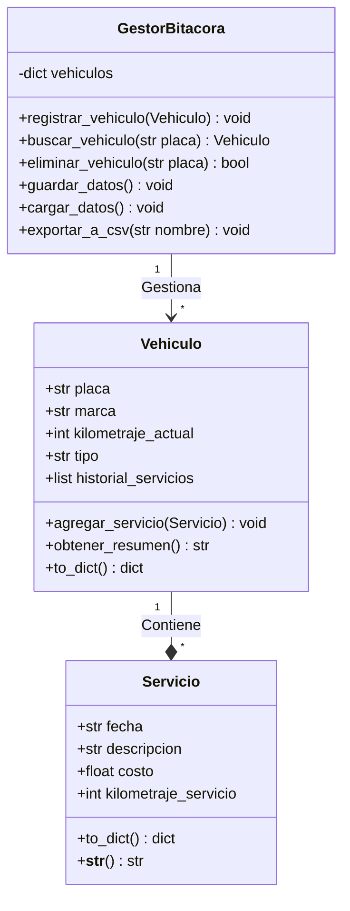

# 🚗 Sistema de Bitácora Automotriz 🏍️

Este proyecto es una aplicación de escritorio desarrollada en Python que permite a los usuarios (particulares o talleres mecánicos) llevar un registro detallado y organizado de los mantenimientos, gastos y el historial de servicios de sus vehículos (Autos y Motos).

> **Tecnologías clave:** Python 3.x, CustomTkinter, JSON (persistencia de datos), CSV (generación de reportes).

---

## 🏗️ Arquitectura y Patrones de Diseño

El sistema fue construido aplicando principios de **Programación Orientada a Objetos (POO)** y el patrón arquitectónico **MVC (Modelo-Vista-Controlador)** para garantizar un código limpio, escalable, mantenible y con bajo acoplamiento.

### 🧬 Aplicación de Pilares POO
* **Encapsulamiento:** Las clases `Vehiculo` y `Servicio` protegen sus datos. Por ejemplo, el cálculo del total gastado se realiza de forma interna dentro de la propia clase `Vehiculo`, evitando que factores externos manipulen las matemáticas o alteren los estados de forma arbitraria.
* **Validación de Estado Strict:** Los constructores aplican reglas de negocio estrictas (expresiones regulares para control de placas, restricciones numéricas de costo positivo y orden cronológico de kilometraje), lanzando excepciones controladas (`ValueError`) para proteger la integridad de los datos ante ingresos corruptos o anómalos.
* **Composición:** Un `Vehiculo` contiene una lista dinámica de objetos `Servicio` (`list[Servicio]`), reflejando una relación del mundo real donde el ciclo de vida del servicio depende enteramente de la existencia de la entidad vehicular.

### 📐 Aplicación de la Arquitectura MVC
* **Modelo (`app/models/`):** Gobierna la lógica pura del negocio (`Vehiculo`, `Servicio`, `GestorBitacora`). Maneja de forma exclusiva los datos y la persistencia sin ninguna interacción directa con el usuario (completamente libre de `prints` o `inputs`).
* **Vista (`app/views/`):** Construida con la librería avanzada **CustomTkinter** (basada en tkinter), renderizando componentes gráficos asíncronos y una interfaz moderna con soporte nativo para temas oscuros (*Dark Mode*) y claros.
* **Controlador (`app/controllers/`):** Orquesta el flujo de la aplicación. Actúa como el puente de comunicación: captura los eventos y formularios de la Vista, los envía al Modelo para su validación/almacenamiento, intercepta los errores del Modelo mediante bloques estructurados de excepciones y le pide a la Vista desplegar alertas visuales (*Pop-ups*) seguras sin romper el hilo de ejecución.

---

## 📂 Estructura del Proyecto

El árbol de directorios del espacio de trabajo está segmentado bajo estándares de modularidad:

```text
bitacora-automotriz-mvc/
│
├── app/                        # Código fuente principal del sistema (Capa MVC)
│   ├── controllers/            # Controladores (Intermediarios lógicos)
│   │   └── bitacora_controller.py
│   ├── models/                 # Modelos (Entidades de negocio y lógica core)
│   │   ├── gestor.py
│   │   ├── servicio.py
│   │   └── vehiculo.py
│   └── views/                  # Vistas (Interfaz Gráfica de Usuario - GUI)
│       └── grafica_view.py
│
├── docs/                       # Documentación técnica e informes del proyecto
│   ├── capturas/               # Banco de evidencias visuales de QA y UI
│   └── proceso_desarrollo.md   # Informe del proceso formal de desarrollo
│
├── tests/                      # Suite de pruebas unitarias automatizadas
│   └── test_modelos.py
│
├── bitacora.json               # Persistencia de datos local estructurada en JSON
├── main.py                     # Punto de entrada principal de la aplicación (Entrypoint)
└── requirements.txt            # Declaración estricta de dependencias externas

```

---

## 📋 Prerrequisitos

Para ejecutar el sistema, es necesario tener instalado el lenguaje de programación Python en tu equipo.

1. **Descarga de Python:**
* Ve al sitio web oficial: [python.org/downloads](https://www.python.org/downloads/)
* Descarga la última versión estable compatible para tu sistema operativo (Windows, macOS o Linux).


2. **Instalación (Paso Crítico):**
* **En Windows:** Durante el asistente de instalación, **asegúrate de marcar la casilla que dice "Add Python to PATH"** antes de dar clic en instalar. Esto es fundamental para que la terminal de comandos del sistema reconozca los binarios de `python` y `pip`.


3. **Verificación:**
Para confirmar que Python se configuró correctamente en tu entorno global, abre una terminal y ejecuta:
```bash
python --version

```


---

## ⚙️ Instalación y Execución

Para garantizar la portabilidad y el correcto funcionamiento del software en cualquier entorno local, se han seguido estándares de desarrollo modular:

* **Compatibilidad:** El sistema es completamente multiplataforma (Windows, macOS y Linux).
* **Gestión de Dependencias:** El proyecto automatiza la instalación de librerías mediante el gestor corporativo `pip` utilizando el manifiesto `requirements.txt`.
* **Recomendación de Entorno (Best Practice):** Se aconseja desplegar el proyecto dentro de un Entorno Virtual (`venv`) para aislar las librerías globales de tu máquina y evitar conflictos de versiones.

### Pasos secuenciales para ejecutar el proyecto:

1. Clona este repositorio en tu computador:
```bash
git clone [https://github.com/2003EVA/bitacora-automotriz-mvc.git](https://github.com/2003EVA/bitacora-automotriz-mvc.git)

```


2. Entra en la carpeta raíz del proyecto:
```bash
cd bitacora-automotriz-mvc

```


3. Instala las dependencias necesarias de manera automática:
```bash
python -m pip install -r requirements.txt

```


4. Ejecuta la aplicación:
```bash
python main.py

```


---

## 🧪 Pruebas Automatizadas (QA)

* El proyecto utiliza el framework **`pytest`** para asegurar la estabilidad operacional del Modelo matemático y lógico mediante el enfoque **TDD (Test-Driven Development)**.
* La suite incluye validaciones integrales para flujos normales (casos de éxito en instanciación y acumulación financiera) y flujos inválidos (disparo programado de excepciones ante datos corruptos o placas mal formateadas).

### Ejecución de Pruebas en Windows (PowerShell):

Para asegurar el correcto mapeo de módulos de la arquitectura, inyecte la variable de entorno local antes de lanzar el motor de pruebas:

```powershell
$env:PYTHONPATH="."
pytest tests/

```

---

## 📈 Diagrama de Clases (UML Estructural)

Modelado de dominio del sistema renderizado mediante sintaxis Mermaid. Se corrigieron los cierres de encapsulamiento para evitar cortes visuales en la plataforma de GitHub:



---

## 📸 Vista Previa de la Aplicación y Evidencias

### 1. Interfaz Gráfica y Menú Principal

Muestra el diseño visual del sistema en modo oscuro desarrollado con CustomTkinter.


### 2. Funcionalidad y Registro

Evidencia del comportamiento del programa al interactuar y registrar datos en los formularios.


### 3. Persistencia de Datos (Formato JSON)

Confirmación de que los registros se salvan de forma permanente en el archivo local.


### 4. Reporte de Pruebas Unitarias Exitosas (Pytest)

Reporte exitoso de la terminal de QA tras la ejecución del comando de pruebas.


### 5. Repositorio en GitHub

Estado del control de versiones en la plataforma web con la estructura final de carpetas.


